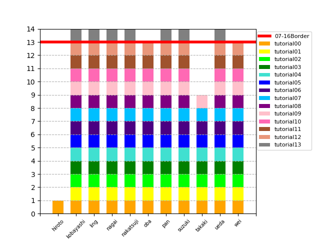

# NLPtutorial2020
小町研2020年度新入生の基礎勉強会として、NLPプログラミングチュートリアルを実施します。
教材URL：http://www.phontron.com/teaching.php?lang=ja
勉強会URL：http://cl.sd.tmu.ac.jp/groups/programming-tutorial

### 進め方（予定）
1. 勉強会で教材の内容を確認する。
2. 次週までに課題を解き、レポジトリにあげる。
3. 次週の冒頭で代表者がコードを説明する。
4. コードや内容についてTAが解説・レビューする。

### コーディングについて
基本的にPython3系を使用してください。
わからないところはTAまたは研究室の人に聞いてください。
**他の人のコードは変更しないでください。**

### レポジトリのあげかた
1. 各チュートリアル毎に、"tutorial##"（##はチュートリアルの番号を2桁で）フォルダを作成。
2. 資料内もしくは勉強会内で指定した形式で課題を解く。
3. `git branch tutorial<nn>/<name>`でブランチを作る
4. `git checkout tutorial<nn>/<name>`でブランチの中に移動する
5. `git add スクリプト名`（ワイルドカード*も使用可）
6. `git commit -m 'コメント'`（コメントは自由に）
7. `git pull` (**必ずやりましょう**)
8. `git push origin master`
9. Pull Requestsを作ってレビューしてもらう

### みんなの進捗

